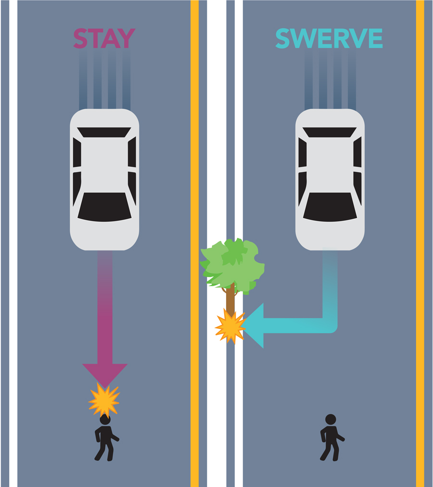
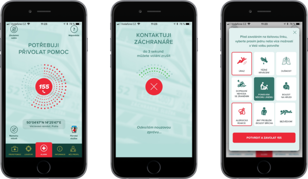
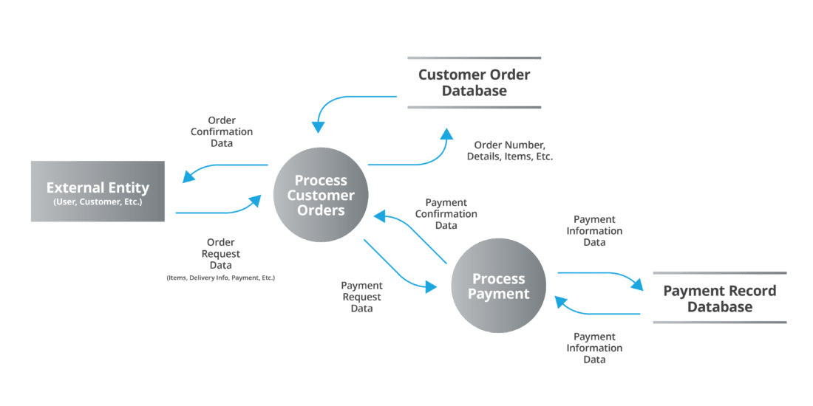

# KPM/SPM

Systémové přístupy v managementu

Přednáška 1

pesikj@fek.zcu.cz

---

# Podmínky získání zápočtu

* Zpracování a úspěšná obhajoba semestrální práce
* Je potřeba získat min. 25 bodů
  * 5 bodů za sestavení funkčního modelu dle zadání (včetně výchozích hodnot),
  * 10 bodů za optimalizaci parametrů modelu a zdůvodnění upravených parametrů,
  * 10 bodů za propojení s nejbližší skupinou,
  * 10 bodů za propojení s nejbližší dvojicí skupin,
  * 15 bodů za účast na přednášce externího hosta (7. října 2024).

---

# Zkouška

* Písemný test
  * 10 otázek hodnocených ve stupnici 0 (nejhorší) - 5 (nejlepší),  tj. celkem max. 50 bodů. 
  * Minimální počet bodů pro uznání zkoušky: 25
* Konečné hodnocení je dáno **součtem** bodů za semestrální práci a za závěrečný test.

* Vacek,J., Pešík, J. (2022) Systémové přístupy v managementu. https://dspace5.zcu.cz/handle/11025/50864

---

# Obsah předmětu

1. Základní pojmy a přístupy
1. Zpětné vazby v technických, sociálních a ekonomických systémech, systémová dynamika, systémové archetypy
1. Prognózování, strojové učení
1. Praktické využití simulací v byznysu (Přednáška externího hosta)
1. Strojové učení a umělá inteligence
1. Systémové přístupy v bezpečnosti
1. Teorie her 1
1. Teorie her 2

---

# Obsah předmětu

9. Průmysl 4.0 a společnost 4.0
9. Technologické trendy a jejich dopad na konkurenceschopnost
9. Systémové přístupy v oblasti soft skills
9. Agilní řízení, systémové přístupy v řešení problémů a řízení rizika
9. Kolaborativní nástroje, sdílení znalostí

---

# Proč systémový přístup?

V managementu se každodenně setkáváme s potřebou řešit podnikové, organizační, personální, technické a další problémy, které jsou navzájem propojeny jak interně, tak externě. Pokud nebereme jejich souvislosti dostatečně v úvahu, budou naše řešení neefektivní, případně budou mít nepředvídané následky.

Takové komplexní problémy vyžadují **systémový (celostní, holistický) přístup**.

---

# Co je systém a jak se chová?

**Systém** je souborem závislých prvků, které mezi sebou vzájemně **interagují**.

**Vstupy** do systému jsou prostřednictvím procesů, nástrojů a technik **transformovány** na **výstupy**, které jsou často vstupy do jiných komponent systému nebo do jiných systémů.

---

# Co je systém a jak se chová?

Vzhledem k těmto vazbám a vlivům je chování systému složité – každá **změna prvku** nebo vazby způsobí **změnu chování systému**.

Systémové myšlení je důležité pro řešení všech komplexních problémů v manažerských disciplínách a je jedinou cestou, jak dospět k dlouhodobým řešení, předejít opakujícím se problémům a minimalizovat neočekávané důsledky.

---

# Hlavní pojmy

- Prvky (části) systému - ve firemním prostředí např. oddělení, zdroje (zaměstnanci, materiál) atd.
- Vazby - spojení mezi prvky (jednosměrné, obousměrné, zpětné). Interakce probíhá prostřednictvím prvků. Např. marketingová kampaň, nábor zaměstnanců atd.
- Hlavní cíl systému - generování zisku, růst atd.
- Zpětnovazební smyčka - na základě výstupu ze systému je vygenerován nový vstup. Např. negativní zpětná vazba zákazníků.

---

# Otevřené a uzavřené systémy

- Okolí systému jsou prvky, které nejsou částí systému, ale mají k němu vazby (i když slabší než uvnitř systému)
- Vstup – působení okolí na systém
- Výstup – působení systému na okolí
- Otevřený systém – má vstupy a výstupy, dochází k interakci s vnějším prostředím
- Uzavřený systém – systém bez vstupů a výstupů (např. oddělení výzkumu a vývoje s vysokým utajením)

---

# Systické a dynamické systémy

- Statický systém – systém, ani jeho elementy se s časem nemění
  - Statický systém hodnocení zaměstnanců na základě výkonu
  - Standarditované výrobní linky
- Dynamický systém – systém a/nebo jeho elementy se s časem mění 
  - Logistický systém Amazonu využívající reálná data k optimalizacím a predikcím

---

# Příklad interakce a zpětné vazby

* R&D vyvine nový produkt. → Marketingové oddělení připraví marketingovou kampaň. → Výrobní oddělení připraví výrobu. → Finanční oddělení zajistí dostatek finančních zdrojů.

* Organizace vyvine nový produkt. → Zákazníci poukážou na nedostatky produktu. → Organizace připraví novou verzi produktu. → Vylepšený produkt získá více zákazníků, kteří vygenerují větší množství zpětné vazby.

---

# Příklady zpětné vazby a reakce na ně

- Společnosti Apple uvedla na trh první iPhone v roce 2007. → Zákazníci a odborná veřejnost poukázali na nedostatky (např. chybějící 3G připojení, nízké rozlišení fotoaparátu, absence copy-paste funkce atd.). → Společnost Apple následně vydala vylepšené verze produktu, která přitáhla další zákazníky.
- Souběžně společnost BlackBerry ignorovala změny na trhu v důsledku příchodu iPhone a dalších smartphonů a ignorovali zpětnou vazbu (fyzická klávesnice, nedostatek aplikací, malý displej).

---

---

# Příklady zpětné vazby a reakce na ně

- Chytré termostaty (např. Nest Thermostat) shromažďují data o změnách nastavení a optimalizují podle toho spotřebu energie.
- Automatické systémy obchodování na akciových trzích (algoritmické obchodování, vysokofrekvenční obchodování), zpětnou vazbou je realizovaný zisk nebo ztráta z aplikované strategie a její případná změna.
- Streamovací služby nabízejí obsah na základě toho, co uživatelé sledují.

---

---

# Interakce s prostředím

- Otevřené systémy interagují se svým okolím 
  - Výměna informací (marketing, výměna objednávek)
  - Poskytování zboží a služeb
  - Finanční toky
  - Materiálové toky, energie
  - Chytré hodinky, IoT zařízení
  - Ovlivňování životního prostředí (měření emisí)

---

# Adaptabilita

- Schopnost reakce na změny vnějšího prostředí (dynamická odezva, adaptabilita, flexibilita atd.)
- Přechod na nové obchodní modely (např. Netflix vs. Blockbuster)
- Adopce nových technologií (implementace AI do existujících produktů, procesů)
- Pandemie (práce z domova, přechod na on-line prodej, rozvoz jídla, on-line konzultace s lékařem)
- Banky a fintech společnosti (PayPal, Portu), kryptoměny atd.

---

# Odolnost

- Schopnost ustát, absorbovat a zotavit se z vnějších šoků
- Odolnost finančních institucí vůči finančním krizím
- Zálohování dat (možnost obnovení v případě kybernetického úkoku, fyzického poškození, chyb)
- Přírodní katastrofy (povodně, zemětřesení atd.)

---

# Starbucks jako systém

- Kavárny (očividná součást)
- Dodavatelský řetězec (káva, zařízení kaváren, přístroje)
- Systém fungování (např. možnosti úpravy ("customization") produktu)
- Marketing
- Zpětná vazba zákazníků

---

# Systémové (celostní, holistické) rozhodování

- Při rozhodování je potřeba brát v úvahu **systém jako celek**, nikoli jeden jeho prvek nebo skupinu prvků.
- Např. nákup materiálu od jiného dodavatele může mít negativní vliv na kvalitu produktu.

---

# Příklady nedostatků systémového přístupu

- Havárie letu SK 751 27. prosince 1991.
  - Pilot těsně po startu snížil tah motorů kvůli letu na křídle.
  - Nedávná úprava software vedla k vypnutí obou motorů a letadlo muselo nouzově přistát.

- Havárie raketoplánu Challenger
  - NASA využila těsnění, u kterého existovala pravděpodobnst sehlání v nízkých teplotách. Použití materiálu nebylo řádně komunikováno v rámci organizace.
---

# Aplikované systémové disciplíny

- Operační analýza
- Systémová analýza
- Systémové inženýrství
- Kybernetika
- Inženýrská psychologie
- Logistika

---

# Operační analýza

- Stanovení optimálních podmínek pro průběh procesu
- Tvorba a využití matematických modelů pro rozhodování, statistické metody, strukturní a síťová analýza, teorie her apod.
  - Formulace problému 
  - Konstrukce modelu 
  - Odvozování řešení z modelů 
  - Implementace a kontrola řešení 

---

# Příklady použití

- Optimalizace rozvrhu letů (optimalizace využití letadel, posádek atd.)
- Optizalizace dodavatelského řetězce (*vehicle routing problem - VHP*)
- Zdravotnictví (využití personálu, operačních sálů atd.)

---

# Systémová analýza

- Zaměřena na poznání systému, rozeznání podstatné vlastnosti systému, obecné od jedinečného
- Nástroje: dekompozice, analýza a syntéza
- Úskalí: celek je víc než součtem svých částí

---

# Příklad použití

- Amazon se skládá z různých subsystémů, které mají odlišné nároky na dostupnost, zabezpečení atd. Systém prošel dekompozicí za účelem rozdělení na menší části.
- Správa uživatelského účtu (kritická součást, vysoké nároky na bezpečnost)
- Katalog produktů (důležité je vyhledávání, počty uživatelů se výrazně mění)
- Platební systém (vysoké legislativní nároky na zabezpečení, integrace se systémy třetích stran)

---

# Příklad použití

- Systém na doporučování obsahu (výpočetně velmi náročný)
- Logistická část systému (neustálá aktualizace)
- Uživatelské recenze (méně kritická část)
- Výhody dekomopozice: škálovatelnost, technologická flexibilita, možnost samostatné údržby

---

---

# Systémové inženýrství

- Projektování a řízení složitých technických systémů
- Požadavky: spolehlivost, respektování omezení, minimalizace nákladů
- Nástroje: systémová analýza a syntéza, modelování, teorie algoritmů
- Hlavní zdroje: 4M - lidé (Men), stroje (Machines), materiály (Materials), peníze (Money)

---

# Metodika systémového inženýrství

- Definování problému nebo úlohy (systému)
- Stanovení (systémových) cílů
- Konceptuální návrh systému
- Analýza navrhovaného systému
- Výběr vhodného (optimálního) systému
- Implementace a provoz systému

---

# Příklad použití metodiky

Příklad použití na vývoj autonomních vozidel Tesla

- Definování problému nebo úlohy (systému)
  - Vývoj plně autonomního řídícího systému, provoz v různých podmínkách, adaptace dopravním předpisům atd.
- Stanovení (systémových) cílů
  - Bezpečnost, spolehlivost, uživatelský zážitek (*user experience*), splnění legislativních požadavků

---

---

# Příklad použití metodiky

- Konceptuální návrh systému
  - Senzory (kamera, LiDAR), řídící software, uživatelské rozhraní
- Analýza navrhovaného systému
  - Simulace, testovací jízdy, využití existujících dat pro terénování systému
- Výběr vhodného (optimálního) systému
  - Např. využití LiDARu vs. čistě optická navigace

---

---

# Příklad použití metodiky

- Implementace a provoz systému
  - Prodej semi-autonomního systému a postupný přechod na plně autonomní

---

# Kybernetika

- Věda o všeobecných zákonech zpracování informací ve složitých systémech a soustavách, které jsou mapovány s použitím smyček v sítích popisujících toky informací. 

---

# Inženýrská psychologie

- Zkoumá interakci lidí a strojů
- Základní principy
  - Design zaměřený na používání lidmi
  - Interakce člověk - počítač (design uživatelského rozhraní)
  - Kognitivní zátěž (nároky na dokončení úkolu)
  - Ergonomie (pohodlí při používání)
  - Bezpečnost
  - Autonomní a semiautonomní řízení

---

# Příklady aplikace inženýrské psychologie

- Kokpit letadla umožňuje snadné sledování kritických přístrojů
- U lékařských přístrojů předpokládáme využivání ve stresové situaci, omezení možnosti nesprávného použití (např. nastavení příliš vysoké dávky léku)
- Design automobilů usnadňuje sledování tachometru za jízdy
- Design e-shopů usnadňuje provedení objednávky

---

---

# Příklady aplikace inženýrské psychologie

- U armádního vybavení též předpokládáme používání ve stresu (*decision fatigue*)
- Sociální sítě (nekonečné scrollování, systém notifikací, systémy na doporučování obsahu, usnadnění sdílení obsahu - potlačení odkazů mimo síť)
- Systém řízení jaderné elektrárny (systém upozornění na kritické události)
- Počítačové hry

---

# Logistika

- Koordinace a synchronizace procesů ve složitých soustavách
- Cíl: dosažení synergického efektu mezi objektem a jeho okolím
- Podniková logistika: koordinuje a synchronizuje toky materiálů, energií, informací a financí tak, aby podnik uspokojil zákazníky a byl efektivní

---

# Základní principy systémového přístupu

- Systém je víc než souhrnem svých částí.
- Systém zkoumáme proto, abychom mohli předpovědět jeho chování.
- Hlavní účel systému je ten, pro jehož dosažení mohou být obětovány jiné cíle.
- Každý systém je informačním systémem: musíme analyzovat, jak dochází k přenosu informací.

---

# Základní principy systémového přístupu

- Složité systémy může být vhodné rozložit na podsystémy, které jsou pak analyzovány samostatně a poté znovu vcelku.
- Systém je dynamickou sítí vzájemně propojených elementů. Změna jednoho elementu způsobí změnu dalších elementů.
- Hranici systému lze změnit podle cílů analýzy

---

# Analýza toku informací

- Diagram toku informací (výměna informací mezi prvky systému, přenosové kanály - např. e-mail, meetingy, interní informační systémy atd.)
- Měření efektivity (např. doba potřebná na úpravu skladovaného možství po potvrzení objednávky)
- Identifikace úzkých hrdel (např. manažeři vytížení spoustou úkolů), redundantní toky informací atd.
- Analýza zabezpečení a integrity informací.

---

---

# Příklad chyb v toku informací

- Útok na Pearl Harbor
  - Americká rozvědka četla šifrovanou komunikaci, ale informace byly postoupeny dále se zpožděním nebo neúplné
  - Velení na Havajských ostrovech si komunikaci vyložilo jako varování před možnou sabotáží, nebylo ověřeno porozumění informacím ani provedená opatření
- Dieselgate (emisní skandál firmy Volkswagen 2015)
  - Pracovníci a střední management nepředávali informace vyššímu managementu z důvodu striktní komunikační struktury

---

# Odkazy a zdroje

* [Starbucks CEO Targets Busy Stores, Simplifies Complex Menu](https://several.com/news/starbucks-ceo-targets-busy-stores-simplifies-complex-menu)
* [Seriál Mayday, epizoda "Pilot Betrayed"](https://www.facebook.com/watch/?v=1735388183479422)
* [LiDAR: The Driving Technology for Autonomous and Semi-Autonomous Mobility](https://www.geospatialworld.net/prime/business-and-industry-trends/lidar-the-driving-technology-for-autonomous-and-semi-autonomous-mobility/)
* [BlackBerry Phone — How Does it Look Today?](https://dmitryelj.medium.com/blackberry-phone-how-does-it-look-today-a6562208fa7b)
* [Záchranka](https://www.zachrankaapp.cz/)
* [What are Microservices? How does Microservices architecture work?](https://middleware.io/blog/microservices-architecture/)
* [Why You Need a Data Flow Diagram](https://www.hbs.net/blog/why-you-need-a-data-flow-diagram/)
