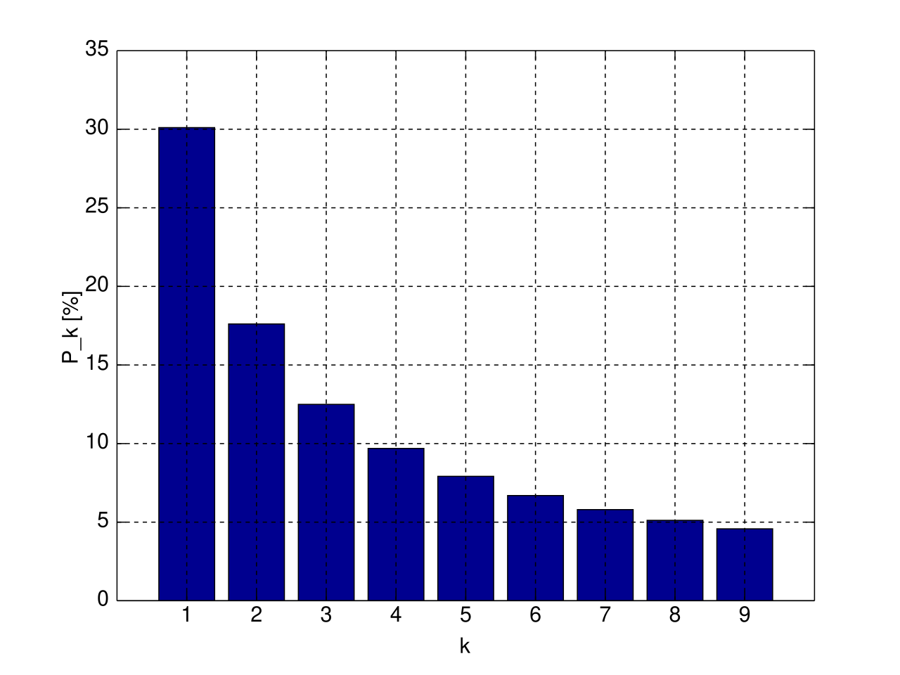

# KPM/SPM

Systémové přístupy v managementu

Přednáška 2

pesikj@fek.zcu.cz

---

# Měkké soustavy

- Prohloubení možností aplikace systémových přístupů k sociálním systémům odráží subjektivní zájmy, přístupy a postoje.
- Neurčitosti spojené se subjektivní interpretací informace a vágností jazyka.

---

# Měkké soustavy

- Metodologie měkkých systémů (-Soft Systems Methodology-)
- Oprava motoru auta - technický problém
- Plánování dopravy ve městě - zahrnuje chování lidí
  - Velké množství různých lidí, které mají různý zájem (motoristé, cyklisté, uživatelé hromadné dopravy, rodiče, uživatelé elektromobilů atd.).

---

# Jak popsat systém

- Slovní popis
- Diagram toků
  - Máme proměnné, stavy a toky
- Smyčkový diagram
  - Máme proměnné a vztahy mezi nimi
  - Nerozlišujeme proměnné a stavy

---

# Stavy, toky a proměnné

- Stav reprezentuje **akumulaci** nebo množství určitého prvku v systému **v daném čase**.
- Tok představuje **změnu stavu** za určité období
- Proměnná se může **libovolně měnit** bez vazby na minulost
- Konstanty jsou hodnoty, které jsou v rámci systému **neměnné**
- Množství peněz na účtu = stav, příchozí a odchozí platby = tok, úroková sazba = konstanta
- Skladová zásoba = stav, prodeje zboží = tok, požadovaná rezerva = proměnná, kapacita skladu = konstanta

---

# Smyčkové diagramy (Causual Loop Diagram - CLD)

- Jeden ze způsobů, jak vytvořit schéma systému
- Klíčové proměnné, vzájemně se ovlivňují
  - Objektivně měřitelné (skladové zásoby, zisk)
  - Neměřitelné (důvěra zákazníků, motivace zaměstnanců, firemní kultura)

---

# Smyčkové diagramy (Causual Loop Diagram - CLD)

- Vztahy mezi proměnnými
  - Musí být vždy jednoznačný
  - Růst první proměnné → růst druhé proměnné. Pokles první proměnné → pokles druhé proměnné. Značíme `+` (zde modrou barvou).
  - Růst první proměnné → růst druhé proměnné. Pokles první proměnné → pokles druhé proměnné. Značíme `-` (zde červenou barvou).

---

---

---

## Typy zpětnovazebních smyšek

- Posilující smyčka 
  - Obsahuje pouze pozitivní vztahy nebo sudý počet negativních vztahů
  - Vede k "nekonečnému" růstu nebo naopak ke kolapsu
  - Značíme `R`
- Vyrovnávací smyčka 
  - Obsahuje lichý počet negativních vztahů
  - Značíme `B`

---

# Posilující smyčka

- Společnost investuje do marketingu procento z tržeb za vydané produkty
- Vzniká posilující smyčka: prodej produktů → zvýšení tržeb → zvýšení investic do marketingu → zvýšení prodeje

---

---

# Vyvažující smyčka

- S růstem skladových zásob společnost snižuje požadavky na výrobu nových produktů
- Vzniká vyvažující smyčka: výše skladových zásob → požadavky na výrobu → přírůstek skladových zásob → skladové zásoby

---

---

# Zpoždění

- Zpoždění, s nimiž se dostavují důsledky
- Mohou být materiálové, informační, finanční
- Důsledky:
  - Odložení investic, infrastruktury atd. 
  - Přestřelení reakce (např. léky proti bolesti).
  - Management: zkracování prodlev – JIT, štíhlá a pružná výroba; důsledek: přeplněné silnice.

---

## Problémy způsobené zpožděním

- Nedostatek zboží z důvodu nedostatku materiálu, ztráta zákazníků
- Problémy s produkcí
- Chyby nebo zpoždění v rozhodování
- Nepřesný odhad budoucího vývoje

---

# Nelinearita

- Změna jedné proměnné nevede k proporcionální změně jiné.
- Úroková sazba stanovená centrální bankou
- Použití hnojiva
- Zdanění (Lafferova křivka)

---

# Systémové archetypy

- Nápravy, které se vymstí
- Přesunutí břemene
- Meze růstu
- Úspěch úspěšným
- Eroze cílů
- Růst a nedostatečné investice
- Eskalace
- Tragédie obecní pastviny (tragédie společného vlastnictví)

---

# Nápravy, které se vymstí

- Krátkodobě účinné nápravné opatření má nezamýšlené (a možná nepředvídatelné) dlouhodobé následky, které vyžadují ještě větší nasazení nápravných opatření.
- Po určité době zjišťujeme, že jsme původní problém nevyřešili, ale že se ještě zhoršil.
- Např. léky proti bolesti či rekreační drogy (uleví od stresu/bolesti atd., ale způsobují závislost, zdravotní problémy atd.)
- Příčiny
  - Zaměření primárně na krátkodobé cíle
  - Tlak ze strany akcionářů

---

---

## Nápravy, které se vymstí (příklady)

- Společnost začne prodávat produkty se slevou, aby vyrovnala krátkodobý pokles tržeb.
  - Zákazníci si zvyknou na sníženou cenu
  - Poškození image společnosti
- Společnost využije úvěr k masivním investicím za účelem zvýšení nebo udržení tržního podílu.
  - Dopad na cash-flow, zisk (platba úroků) 
  - Např. Toys 'R'

---

---

## Nápravy, které se vymstí (příklady)

- Společnost se snaží zvýšit produktivitu zavedením přesčasů.
  - Vyhoření a únava zaměstnanců
  - Příplatky za přesčasy (dopad na zisk)
  - Např. Tesla.
- Společnost sníží počet zaměstnanců za účelem zvýšení zisku.
  - Přetížení zbývajících zaměstnanců → ztráta motivace. Např. General Electric.
- Společnost navýší cenu vlastních akcií jejich nákupem na trhu.
  - Nedostatek financí na další aktivity, např. výzkum a vývoj.

---

## Nápravy, které se vymstí (příklady)

- Zvýšení platů/bonusů dlouhodobě nespokojeným zaměstnancům
  - Vyšší bonusy → krátkodobé zvýšení motivace → návrat k normálu
  - Po delší době efekt odezní

---

## Nápravy, které se vymstí (příčiny a opatření)

- Soustředění se na dlouhodobé hledisko
- Monitorování prediktivních indikátorů (např. spokojenost zákazníků vs. tržby)
- Pilotní projekty
- Analýza plánových opatření

---

# Přesunutí břemene

- Namísto skutečného problému se řeší pouze jeho **symptom**, případně přesunujeme řešení problému na někoho jiného.
- Např. léky proti bolesti zmírní bolest (symptom), ale neřeší skutečný zdravotní problém.
- Vede k odkládání řešení kořenového problému.

---

---

## Přesunutí břemene (příklady)

- Vláda řeší problémy určitého odvětví ekonomiky dotacemi, daňovými úlevami, obchodními bariérami atd.
  - Kořenová příčina: Odvětví není konkurenceschopné (špatné řízení, neefektivita atd.)
  - Morální hazard, "zvyknutí si"
  - Odvětví nebude schopné dlouhodobě přežít

---

---

## Přesunutí břemene (příklady)

- Vláda řeší nedostatek příjmů dluhem namísto poklesem výdajů nebo růstem příjmů
  - Kořenová příčina: Vláda utrácí více, než kolik činí daňové výnosy
  - Přenesení břemene na příští vládu
- Zavádění zákaznických programů namísto zvyšování kvality produktu/služby
  - Kořenová příčina: Nízká kvalita produktu, nedostatek inovací atd.
  - Dlouhodobě neudrží zákazníky
- Outsourcing výroby
  - Kořenová příčina: Neefektivita v řízení, technologiích atd.
  - Problémy se řízením kvality, vyšší nároky na logistiku atd.

---

## Přesunutí břemene (opatření)

- Hledání kořenové příčiny problému a vlivu opatření

---

# Meze růstu (limity růstu)

- Spirálu úspěchu, která současně vyvolává druhotné nechtěné následky, které nakonec úspěch zbrzdí.

---

---

## Meze růstu (příklady)

- Rychlý růst služby Uber
  - Nedostatek řidičů (řešen zvýšením mezd, které zdražily službu)
  - Státní a místní regulace
- Nasycení trhu
  - Netflix (plus náklady na tvorbu vlastního obsahu)
  - Snapchat (plus konkurenční produkty jako Instagram Stories, problém s monetizací)
- Růst množství funkcí (*features*) služby
  - Vede ke snížení rychlosti, přílišné komplexnosti, *over-engineering*
  - MySpace vs. Facebook, WordPress vs Medium, Microsoft Project vs Trello

---

---

---

## Meze růstu (opatření)

- Identifikace limitujících faktorů
- Inovace a diverzifikace
- Udržování efektivity

---

# Úspěch úspěšným

- Více činností soutěží o zdroje. Čím většího úspěchu jedna z nich dosahuje, tím větší podporu získává na úkor druhé.

---

---

## Úspěch úspěšným (příklady)

- Úspěch vyhledávače Google
  - Lepší vyhledávací algoritmus přitáhl nové uživatele
  - Více uživatelů → větší množství dat → lepší algoritmus → více uživatelů
  - Větší příjem z reklamy
- Microsoft Windows a dostupnost aplikací
  - Větší množství uživatelů → více dostupných aplikací → větší množství uživatelů
  - Výnosy z rozsahu

---

---

## Úspěch úspěšným (příklady)

- Sociální sítě
  - Větší množství uživatelů → více obsahu → větší množství uživatelů
- Sportovní obuv Nike
  - Využívání obuvy špičkovými atlety (např. Michael Jordan) → zájem o obuv mezi dalšími uživateli
  - Více zdrojů na vývoj a inovace
- Visa a MasterCard jako globální platební služby
  - Obchodníci vybírají služby dle počtu uživatelů, uživatelé podle počtu obchodníků
  - Výnosy z rozsahu

---

## Úspěch úspěšným (příklady)

- Špičkové univerzity (např. Harvard)
  - Špičkové univerzity přitahují talenty, studenti si vybírají univerzitu dle absolventů
  - Více zdrojů od dárců

---

## Úspěch úspěšným (opatření)

- Inovativní produkty
- Podpora vstupu nových firem do odvětví
- Vyvážení přidělování zdrojů uvnitř organizace

---

# Eroze cílů

- Nedosažení nějakého cíle vede k tomu, že snižujeme cíle, abychom cíle dosáhli. Tím cíle erodují.
- Dlouhodobým důsledkem je snížení nároků, přijetí nízkých výkonů jako standard.

---

## Eroze cílů (příklady)

- Oddalování investic do výzkumu a vývoje (krátkodobý růst zisku)
  - Snížení nákladů na R&D → pomalý inovační cyklus
  - Erodovaný cíl: Udržení inovací a kvality
- Zkracování dodacích lhůt bez zvýšení kapacit
  - Zkrácení termínů → klesající kvalita služeb
  - Erodovaný cíl: Udržení vysoké úrovně služeb

---

## Eroze cílů (příklady)

- Snížení standardů na výběr dodavatelů
  - Výběr levnějších dodavatelů → nižší kvalita materiálů
  - Erodovaný cíl: Kvalitní dodavatelský řetězec
- Snižování rozpočtu na školení zaměstnanců
  - Krátkodobá úspora → nižší odbornost zaměstnanců
  - Erodovaný cíl: Kvalitní lidské zdroje
- Snižování výdajů na údržbu infrastruktury
  - Krátkodobé úspory → dlouhodobé opotřebení
  - Erodovaný cíl: Udržitelnost provozu, nárůst vnitřního dluhu

---

## Eroze cílů (opatření)

- Udržování standardů a hodnot
- Investice do dlouhodobého rozvoje
- Pravidelné přehodnocování cílů a strategií

---

# Růst a nedostatečné investice

- Růst se přibližuje mezi, kterou lze posunout pouze **dostatečnou** investicí do dodatečné kapacity.
- Pokud investice není dostatečně rychlá nebo vysoká, míjí se účinkem a neúspěch se omlouvá snížením cílů.

---

## Růst a nedostatečné investice (příklady)

- Železniční infrastruktura
  - Zvýšený počet cestujících → přetížení tratí → nedostatečné investice do modernizace
  - Opatření: Zvýšení investic do infrastruktury, modernizace tratí a rozšíření kapacity
- Výroba čipů
  - Vysoká poptávka po čipech → přetížení výrobců → nedostatečné investice do nových výrobních kapacit
  - Mitigace: Diversifikace výrobců, investice do nových továren a technologií

---

## Růst a nedostatečné investice (příklady)

- Energetická infrastruktura
  - Vzrůstající poptávka po energii → nedostatečné investice do obnovitelných zdrojů a sítí
  - Mitigace: Zvýšení investic do zelené energie a modernizace distribučních sítí
- E-commerce platformy
  - Růst počtu zákazníků → nedostatečné investice do skladové a logistické infrastruktury
  - Mitigace: Optimalizace dodavatelských řetězců, investice do logistických technologií

---

# Eskalace

- Každý úspěch protistrany vyvolává pocit ohrožení, zvýšení agresivity, atd. 
- Každá strana považuje svoji útočnost za obrannou reakci, což vede k vystupňování, s nímž původně nikdo nepočítal.

---

---

## Eskalace (příklady)

- Eskalace obchodních cel mezi státy
  - Zavedení cel → odvetné tarify → další zvyšování
  - Omezení obchodu
- Cenová válka mezi obchodními řetězci
  - Snížení cen → reakce konkurence → další snižování cen
- Zvýšení mezd pro přilákání zaměstnanců
  - Zvýšení mezd (nebo přidávání benefitů) → reakce konkurence → další navyšování
  - Rostoucí personální náklady

---

---

## Eskalace (příklady)

- Závody mezi Apple a Samsung
  - Nové funkce → reakce konkurence → další inovace
  - Zvyšující se náklady na vývoj
- Zvýšení rychlosti doručení mezi logistickými firmami
  - Rychlejší doručení → reakce konkurence → další zrychlení
- Reklamní výdaje mezi Coca-Cola a Pepsi
  - Zvýšení reklamy → reakce konkurence → další navyšování
  - Rostoucí náklady

---

## Eskalace (opatření)

- Spolupráce s konkurencí (nelegální kartelové dohody)
- Zaměření na unikátní hodnotu
- Regulace odvětví 
- Orientace na dlouhodobou strategii
- Komunikace a vyjednávání

---

# Tragédie obecní pastviny (tragédie společného vlastnictví)

- Jednotlivec, který využívá společný zdroj, čerpá výhody jako jediný, ale náklady jsou rozprostřené rovnoměrně.
- Postupně dojde k vyčerpání společného zdroje.

---

## Tragédie obecní pastviny (příklady)

- Přílišná pastva dobytka na veřejných pozemcích
  - Nadměrná pastva dobytka → degradace půdy → neúrodnost
  - Vede ke znehodnocení pastviny
- Nadměrný rybolov v oceánech
  - Zvýšený rybolov → úbytek rybích populací → kolaps ekosystému
- Znečišťování vzduchu průmyslovými emisemi
  - Nadměrné emise → zhoršení kvality vzduchu → zdravotní problémy

---

## Tragédie obecní pastviny (příklady)

- Nadměrné čerpání podzemních vod v zemědělství
  - Nadměrné čerpání → pokles hladiny → vyčerpání zásob
  - Podobně funguje např. nadměrné používání hnojiv
- Společné vlastnictví bytů v socialistických zemí
  - Obyvatelé neměli důvod starat se o údržbu bytu, investovat do něj atd.

---

## Tragédie obecní pastviny (opatření)

- Zavedení regulačních opatření
- Omezení přístupu ke společným zdrojům
- Spolupráce a dohody o udržitelném využívání
- Zavedení kvót a pravidel pro sdílené zdroje
- Podpora alternativních zdrojů

---

# Příklady selhání intuitivních řešení

- Lidé mají tendenci preferovat intuitivní řešení. V některých případech mohou tato intuitivní řešení selhat.

---

## Narozeninový paradox

* Uvažujeme skupinu lidí. Jak velká tato skupina musí být, aby pravděpodobnost, že mají dva lidé narozeniny ve stejný den, byla vyšší než 50 %?
* Stačí 25 lidí?
* Stačí 50 lidí?
* Stačí 75 lidí?
* Stačí 100 lidí?
* Ve skutečnosti stačí 23 lidí.

---

## Bendfordův zákon

* Uvažujme, že máme k dispozici číselná data (např. velikost států světa, hodnotu veřejných zakázek krajského úřadu atd.)
* Jakou číslicí tato čísla začínají?
* Je pravděpodobnost každé číslice (1-9) stejná?
* Nebo se vyskytuje některá číslice častěji?

---

---

## Monty Hallův paradox

* 3 dveře, za jedněmi z nich je výhra. Vyhrajeme, pokud vybereme dveře s cenou.
* Vybereme jedny z nich. Následně jsou otevřeny jiné dveře, za kterými není výhra.
* Zbývají tedy 2 dveře - ty, které jsme si vybrali na začátku, a jedny zbývající. Můžeme změnit naše rozhodnutí a vybrat si druhé dveře.
* Otázka: Zvýšíme pravděpodobnost výhry výměnou vybraných dveří?

---

## Problém Lindy

* Uvažujme dva výroky. Který z nich je s větší pravděpodobností pravdivý?
  * Linda pracuje v bance
  * Linda pracuje v bance a má nadprůměrný příjem
* Pravděpodobnější je první výrok, protože druhý výrok je prvního výroku plus jedné dodatečné informace

---

## Další paradoxy

- Kognitivní paradox
  - Lidé přeceňují pravděpodobnost událostí, které mají vysokou publicitu (např. pád letadla, útok žraloka atd.)
- Paradox výběru
  - Příliš velké množství možností je pro zákazníka horší než malé množství.

---

# Odkazy a zdroje

- [Amazon didn't kill Toys 'R' Us. Here's what did](https://money.cnn.com/2018/03/15/news/companies/toys-r-us-closing-blame/index.html)
- [Tesla’s ‘ultra hardcore’ work culture — as told by its employees](https://www.theverge.com/2023/8/16/23833447/tesla-elon-musk-ultra-hardcore-employees-land-of-the-giants)
- [William Braun. The System Archetypes](https://www.albany.edu/faculty/gpr/PAD724/724WebArticles/sys_archetypes.pdf)
