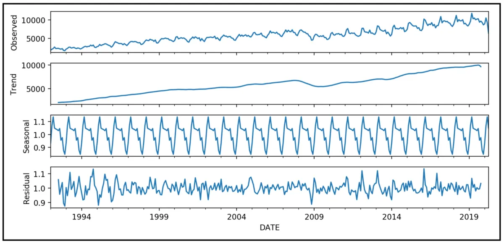
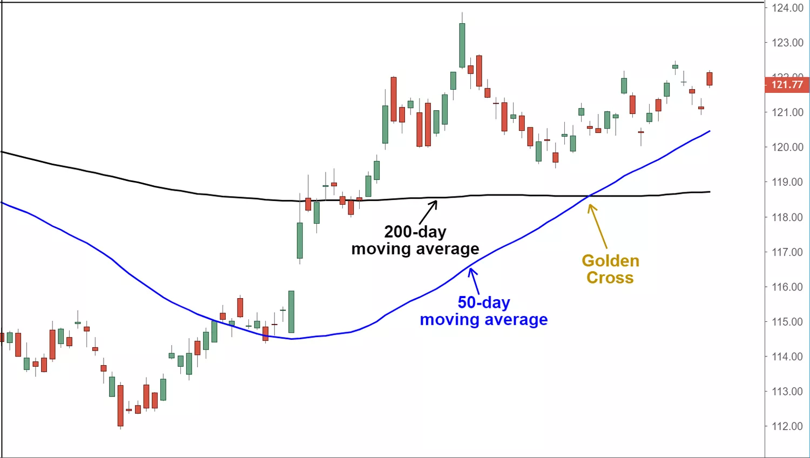
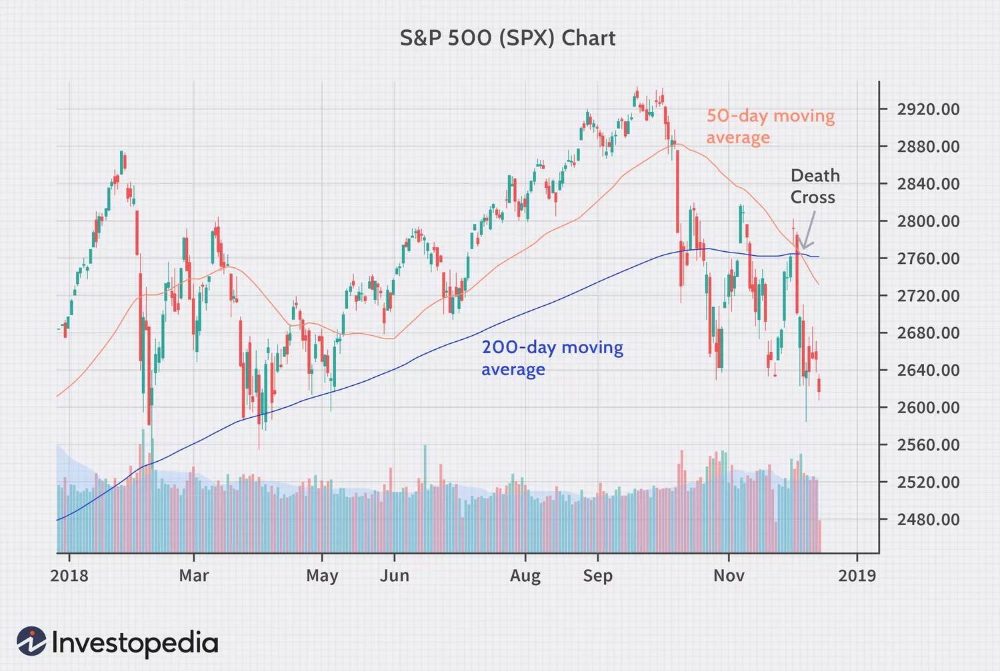
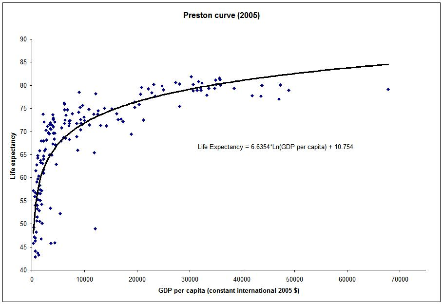
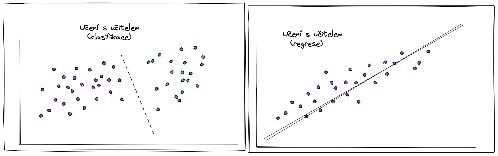
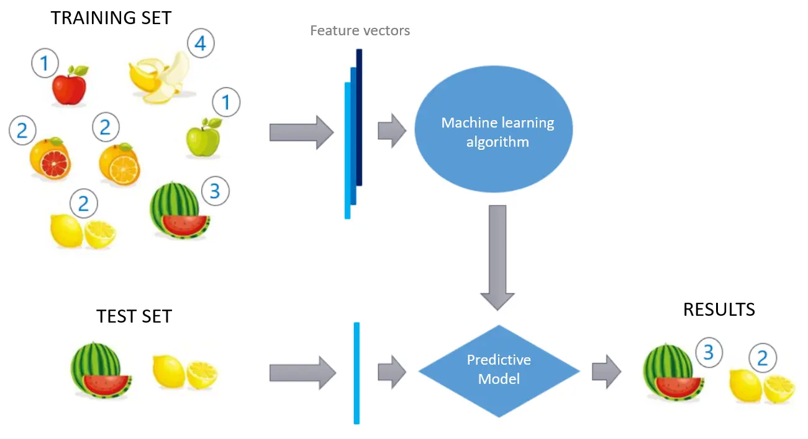
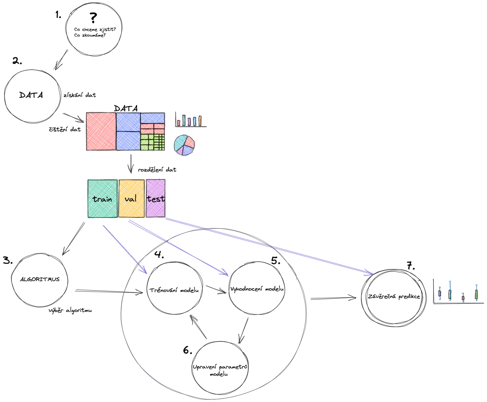
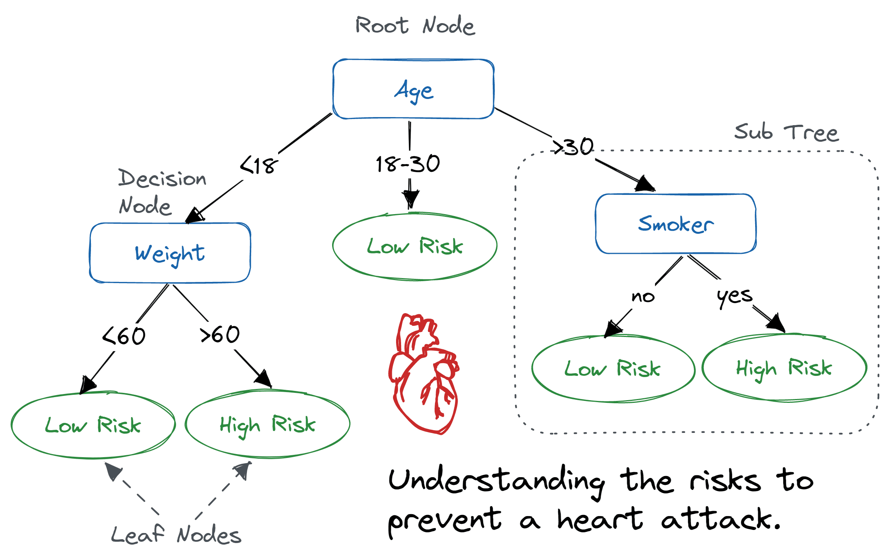
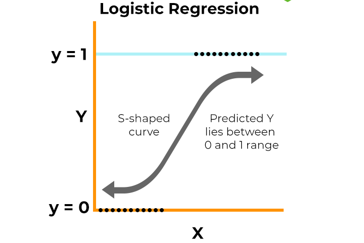
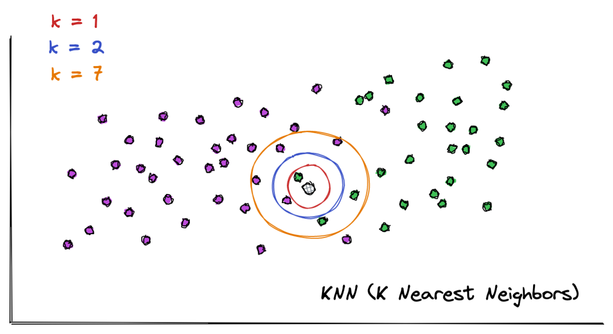

# KPM/SPM

Systémové přístupy v managementu

Přednáška 3

pesikj@fek.zcu.cz

---

# Prognózování

- Prognózování je proces, při kterém se snažíme předpovědět budoucí vývoj nějaké veličiny nebo situace na základě historických dat, trendů a různých matematických a statistických metod.
- Několik kroků
  - sběr dat
  - výběr modelu
  - aplikace modelu a vyhodnocení
  - vyhodnocení nejistoty

---

## Typy prognózování

- Kvantitativní prognózy (matematické a statistické modely pro předpovědi na základě číselných dat)
- Kvalitativní prognózy (použití odborných znalostí, zkušeností a subjetivního úsudku)
- Kombinace obou přístupů

---

## Metody kvalitativního prognózování

- Delphi metoda
  - Skupina odborníků, je jich poslána sada otázek, odpovědi jsou anonymně vyhodnoceny a je odeslána další série otázek.
  - Proces se opakuje, dokud není dosaženo konsenzu.
- Metoda scénářů
  - Probíhá diskuse nad několika scénáři možného vývoje.
- Odhad podle minulého vývoje
- Panel expertů (debata expertů, může převážit dominantní jedinec)
- Brainstorming

---

## Metody kvantitativního prognózování

- Statistické metody
- Časové řady
- Metody strojového učení, hluboké učení
- Predikční trhy
- Simulační metody

---

# Tradiční statistické metody

- Vysvětlující modely
  - Zaměřují se na pochopení vztahů mezi proměnnými a interpretaci parametrů modelu.
- Jednoduchost a srozumitelnost výstupů
  - Parametry lze snadno interpretovat.
- Předpoklady o datech
  - Většina metod vyžaduje splnění určitých předpokladů
- Dobře definované vztahy a výkumné problémy
  - Vhodné pro případy, kdy jsou vztahy dobře definovány.

---

## Testování statistických hypotéz

- Máme dvě hypotézy - nulovou a alternativní
- Obvykle "chceme" zamítnoust alternativní hypotézu
- Je potřeba zvolit vhodný test (např. t-test, F-test atd.)
- Výsledkem je obvykle p-hodnota a rozhodnutí o (ne)zamítnutí nulové hypotézy.

---

---

## Časové řady

- Analyzují data závislá na čase a identifikují trendy a sezónní vzory
- Dekompozice (rozdělení na trendovou, sezónní, cyklickou a náhodnou složku)
- Klouzavé průměry, exponenciální vyrovnávání atd.
- Box-Jenkinsova metoda

---

---

---

---

## Box-Jenkinsova metoda (ARIMA modelování)

- Hledá vztahy mezi současnými hodnotami a jejich historickými hodnotami a chybami, aby vytvořil co nejpřesnější predikci.
- Obsahuje tři složky:
  - AR (AutoRegresní složka): Závislost aktuální hodnoty časové řady na předchozích hodnotách.
  - I (Integrated složka): Váže se k odstranění trendu.
  - MA (Průměrující složka - Moving Average): Závislost aktuální hodnoty na chybách (reziduích) z předchozích období.

---

## Regresní analýza

- Využívá jednu nebo více vysvětlujících (nezávislých) proměnných a jednu vysvětlovanou (závislou) proměnnou.
- Popisuje vztah mezi proměnnými pomocí matematické funkce.
- Můžeme využít různé typy regresních funkcí (lineární, polynomická, exponenciální, logaritmická.)

---

---

---

# Metody strojového učení

- Zahrnuje techniky a algoritmy, které umožňují počítačům "učit se" z dat a vytvářet prediktivní modely čistě na základě těchto dat.
- Učení s učitelem (*supervised learning*)
  - Máme data, ke kterým známe "správné odpovědi" (*labels*)
  - Chceme model, který predikuje správné odpovědi u *nových* dat.
- Učení bez učitele (unsupervised learning)
  - Máme data bez správných odpovědí
- Kombinací obou přístupů je reinforcement learning
  - Model se učí na základě interakce s prostředím a zpětné vazby

---

### Příklady úloh řešených strojovým učením

- Detekce podvodů v bankovnictví
- Doporučovací systémy (doporučení filmů, televizních pořadů nebo produktů založených na chování uživatelů.)
- Rozpoznávání obličeje
- Autonomní vozidla
- Prediktivní údržba
- Zdravotnictví a medicína (diagnostika chorob, předvídání výsledků léčby a vývoj nových léků)
- Hudba a umění (generování hudby, textů atd.)

---

### Příklady úloh řešených strojovým učením

- Zpracování přirozeného jazyka (NLP, automatický překlad jazyků, generování textu, rozpoznávání hlasu)
- Bezpečnostní systémy (detekce neobvyklých aktivit nebo útoků)
- Energetika (optimalizace výroby a distribuce energie, predikce spotřeby energie)
- Marketing a prodej (segmentace zákazníků, předpověď chování, personalizace reklamních kampaní)
- Sociální sítě (predikce chování, doporučování obsahu)

---

## Supervised learning

- Vysvětlovaná proměnná (*target variable*)
  - Používáme ji k predikci
- Vysvětlující proměnná (*feature*)
  - Predikujeme ji
- Regresní úloha = vysvětlovaná proměnná je číslo (např. reálné)
  - Predikce ceny nemovitosti
- Klasifikační úloha
  - Rozdělujeme data do 2 a více skupin
  - Dvě skupiny = binární klasifikace

---

---

## Supervised learning (postup)

- Definice problému, příprava dat (např. čištění)
- Rozdělíme data na trénovací, testovací a validační
  - Trénovací = slouží k přizpůsobení modelu datům
  - Testovací = ověřuje kvalitu aktuálního nastavení modelu
  - Validační = používáme až na úplný konec
- Vybereme vhodný algoritmus (nebo několik algoritmů)
- Trénování modelu, vyhodnocení a upravení parametrů
- Závěrečná predikce

---

---

---

### Příklady algoritmů

- k Nearest Neighbors (k nejbližších sousedů)
- Rozhodovací strom (*decision tree*), náhodný les (*random forrest*)
- Logistická regrese
- SVM (Support Vector Machine)
- Lineární regrese
- Gradient Boosting Machines

---

### Příklad konkrétní úlohy

- Máme data o pacientech (věk, hmotnost, (ne)kuřák)
- Víme, jestli měli nebo mají potíže ze srdcem
- Chceme vytvořit model, který bude predikovat potíže se srdcem u nových pacientů
- Můžeme se dopustit dvou chyb:
  - False Positive (**FP**, predikujeme potíže, i když je pacient nemá)
  - False Negative (**FN**, predikujeme, že pacient nemá potíže, i když je ve skutečnosti má)
- Použijeme algoritmus rozhodovací strom (decision tree), který je snadno interpretovatelný

---

---

### Vyhodnocení - matice záměn (Confusion Matrix)

|                 | Pred. potíže | Pred. bez potíží |
|-----------------|-------------------------|-----------------------------|
| Skutečnost: Potíže    | True Positive (TP)           | False Negative (FN)          |
| Skutečnost: Bez potíží | False Positive (FP)          | True Negative (TN)           |

|                 | Pred. potíže | Pred. bez potíží |
|-----------------|-------------------------|-----------------------------|
| Skutečnost: Potíže    | 30          | 10          |
| Skutečnost: Bez potíží | 20          | 40           |

---

### Vyhodnocení - metriky

- Přesnost (*Accuracy*) = počet správných predikcí vůči všem = (30 + 40) / (30 + 10 + 20 + 40) = 0,7
- *Precision* - penalizuje za FN chyby
- *Recall* - penalizuje za FP chyby
- F1 skóre - je počítaná ze všech výše uvedených metrik
- Metriky jsou čísla v intervalu 0 až 1

---

### Přeučení (overfitting)

- Overfitting nastane, pokud se model příliš přizpůsobí trénovacím datům, tj. že se naučí zachytit nejen skutečné vzory a trendy, ale i šum a náhodné odchylky v trénovacích datech.
- Příčiny
  - Malé množství dat
  - Příliš detailní model (např. příliš velký strom)
- Důsledky
  - Model nebude dobře fungovat pro jiná než trénovací data

---

### Závažnost chyb

- V praktických aplikacích můžou mít chyby různý dopad
- Podezření na srdeční potíže, rakovinu atd. (zbytečné poslání pacienta vs ohrožení zdraví)
- Bezpečnostní kontrola na letišti (zdržení vs ohrožení bezpečnosti)
- Nežádoucí účinky léku (odložení distribuce vs poškození zdraví pacientů)
- Rozhodnutí o výhodnosti investice (finanční ztráta vs ušlý zisk)

---

### Support Vector Machine ("metoda podpůrných vektorů")

- Rozdělíme rovinu na dvě části - jedna "patří" první skupině, další druhé skupině
- Predikujeme podle toho, kde se nějaký bod nachází
- Body nejblíže "hranici" označujeme jako support vector
- Penalizace za umístění hodnoty na "nesprávné" straně

---

---

.jpeg)

---

### Logistická regrese

- Založená na speciální funkci (sigmoid)
- Predikuje pravděpodobnost, že pozorování patří do jedné ze skupin

---

---

### k Nearest Neighbours

- Predikci provádíme pomocí *k* nejbližších bodů 
- Parametr *k* určuje, kolik sousedů je uvažováno

---

---

# Odkazy a zdroje

- [Golden Cross Pattern Explained With Examples and Charts](https://www.investopedia.com/terms/g/goldencross.asp)
- [Time Series Decomposition](https://medium.com/@roshmitadey/time-series-decomposition-62cbf31ab65e)
- [Preston curve](https://en.wikipedia.org/wiki/Preston_curve)
- [PythonProDataScience](https://github.com/pesikj/PythonProDataScience)
- [Decision Tree Classification in Python Tutorial](https://www.datacamp.com/tutorial/decision-tree-classification-python)
