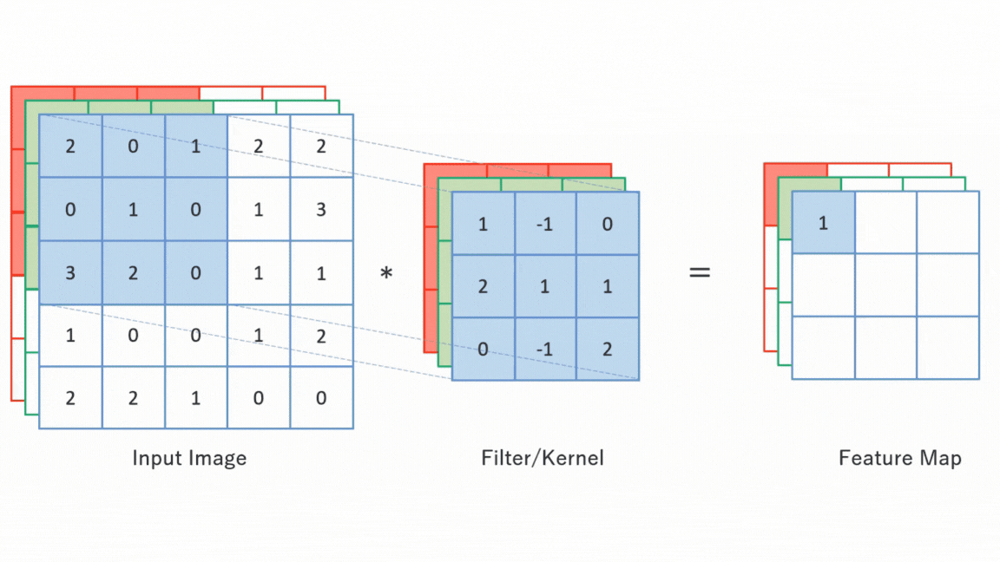
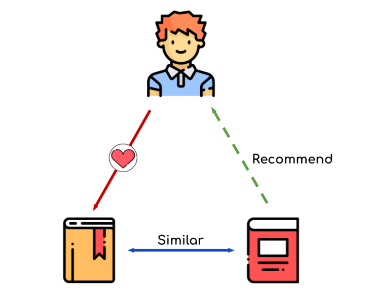
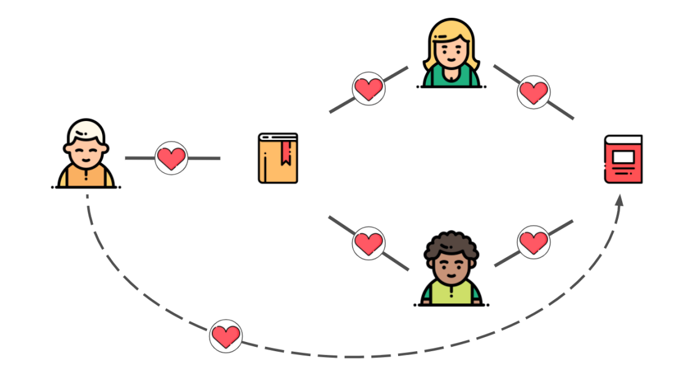
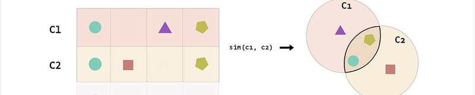

# KPM/SPM

Systémové přístupy v managementu

Přednáška 5

pesikj@fek.zcu.cz

---

# Deep Learning

- Deep Learning je součástí strojového učení zaměřená na **modelování složitých struktur** v datech pomocí vícevrstvých neuronových sítí.

---

## Základní koncepty Deep Learningu

- **Neuronové sítě** jsou inspirovány strukturou lidského mozku.
- Základní stavební jednotkou je *umělý neuron*, který zpracovává vstupy a generuje výstup.
- Výpočetní modely v Deep Learningu zahrnují:
  - Plně propojené sítě (*feedforward networks*)
  - Rekurentní sítě (*recurrent neural networks*)
  - Konvoluční sítě (*convolutional neural networks*)

---

## Základní struktura neuronu

- **Neuron** je základní stavební jednotkou neuronové sítě.
- Každý neuron obsahuje následující komponenty:
  - *Vstupy*: Hodnoty z předchozí vrstvy nebo přímo z dat.
  - *Váhy*: Koeficienty určující vliv každého vstupu.
  - *Aktivační funkce*: Transformuje kombinované vstupy.
  - *Výstup*: Hodnota, která je poslána do dalších neuronů.

---

---

## Matematický model neuronu

- Matematický výpočet neuronu se vyjadřuje jako:
  $$ y = f\left(\sum_{i=1}^n w_i \cdot x_i + b\right) $$

  - $x_i$ jsou vstupní hodnoty
  - $w_i$ jsou váhy
  - $b$ je bias (*posun*)
  - $f$ je aktivační funkce (např. sigmoid, ReLU)

---

---

## Aktivační funkce

- **Aktivační funkce** umožňují neuronové síti modelovat **nelineární vztahy** mezi vstupy a výstupy.
- Bez aktivační funkce by síť byla pouze **lineární** kombinací vstupů, což by omezilo její schopnost učení složitých vzorů.
- Např. funkce ReLU - pro $x > 0$ vrací $x$ a pro $x < 0$ vrací 0.

---

## Vstupní vrstva neuronové sítě

- Vstupní vrstva je první vrstvou neuronové sítě.
- Obsahuje **počet neuronů odpovídající počtu atributů** (vlastností) ve vstupních datech.
- Účelem je **přijímat vstupní data** a předávat je do skrytých vrstev.
- Příklady vstupů:
  - Obrázky: Každý pixel jako vstupní prvek.
  - Text: Každé slovo nebo znak jako vstupní prvek.

---

## Výstupní vrstva neuronové sítě

- Výstupní vrstva určuje **výstupní hodnoty** sítě na základě finálního výpočtu.
- Počet neuronů odpovídá **počtu tříd nebo cílových hodnot**.
- Výstupy mohou být:
  - Pravděpodobnost tříd (*classification*)
  - Skutečné hodnoty (*regression*)

---

## Skrytá vrstva

- **Skrytá vrstva** je střední vrstva v neuronové síti
  - Není přímo přístupná vstupním nebo výstupním datům
  - Hraje klíčovou roli při extrakci vzorců a vztahů
- **Transformace vstupů** na nové reprezentace
  - Pomocí váhových koeficientů a aktivačních funkcí
- Skryté vrstvy přispívají k nelinearitě a schopnosti sítě učit se komplexní vztahy

---

## Trénování

- Trénování neuronové sítě zahrnuje **optimalizaci vah** mezi neurony tak, aby síť správně předpovídala výsledky.

- Vstup a počáteční váhy
  - **Vstupní data** se předávají skrz vrstvy sítě.
  - Váhy jsou zpočátku nastaveny náhodně.
- Výpočet chyby (Loss)
  - Síť generuje výstup a porovnává ho se skutečnou hodnotou.
  - **Chyba** (např. *Mean Squared Error*) je vyčíslena jako rozdíl mezi předpovědí a skutečným výsledkem.

---

- Optimalizace (Backpropagation)
  - Pomocí **zpětného šíření chyby** (*backpropagation*) se spočítají gradienty pro úpravu vah a váhy jsou aktuálizovány, aby došlo k minimalizaci chyby.
- Aktualizace vah
  - Váhy jsou opakovaně upravovány pomocí **učícího kroku** až do dosažení optimální přesnosti.

---

# Feedforward neuronové sítě

- Feedforward sítě jsou nejjednodušší typ neuronových sítí.
- Informace v těchto sítích **teče jedním směrem** – od vstupní vrstvy přes skryté vrstvy k výstupní vrstvě.
- Neexistují zde zpětné vazby nebo smyčky.

---

## Rekurentní neuronové sítě (RNN)

- Jsou navrženy pro sekvenční data, kde záleží na pořadí vstupů.
- Na rozdíl od feedforward sítí mají **cyklické spoje**, které umožňují **zpětné vazby**.
- Používají **paměť**, která uchovává informace z předchozích kroků, což je užitečné pro **časové řady** nebo **zpracování textu**.
- **Rekurentní vazby**: Výstup z jednoho časového kroku ovlivňuje výstup v dalším kroku.
- Umožňují modelovat **závislosti** mezi datovými body v časové řadě nebo textu.

---

# Konvoluční neuronové sítě (CNN)

- Jsou navrženy pro efektivní zpracování **obrazových dat** a dalších strukturálních dat (např. videa).
- CNN využívají speciální vrstvy, které zachycují **prostorové vzory** v datech prostřednictvím **konvoluce**. 
  - Konvoluce aplikuje **filtr** na vstupní obraz a vytváří tzv. *feature map*.
  - **Filtr (jádro)** je malé okno o pevné velikosti (např. 3x3 nebo 5x5), které se pohybuje po celém obrazu.
- Užívají se k identifikaci objektů na fotografiích, počítačovému vidění, zpracování rentgenových snímků atd.

---

---

## Transfer Learning

- Technika, která umožňuje využít **předem naučené modely** na nové úlohy s minimálním trénováním.
- Místo vytváření modelu od začátku se vezme model natrénovaný na rozsáhlých datech (např. ImageNet) a upraví se na konkrétní úlohu.
- Transfer Learning připojí na existující neuronovou síť novou výstupní vrstvu.

---

## Generativní neuronové sítě

- Modely, které se snaží **generovat nové vzory** na základě trénovacích dat.
- Místo klasifikace nebo predikce hodnot generují nové příklady, které **statisticky odpovídají trénovacím datům**.
- **Transformery** jsou moderní architektura neuronových sítí, které se osvědčily v generativních úlohách zpracování přirozeného jazyka.
- Základní stavební jednotkou je **mechanismus pozornosti** (*attention*), který umožňuje modelu soustředit se na různé části vstupu.
  
---

## Klíčové vlastnosti transformerů:
- **Paralelizace**: Na rozdíl od rekurentních sítí mohou zpracovávat celé sekvence najednou.
- **Pozornost (Attention)**: Mechanismus, který modelu umožňuje identifikovat důležité části vstupu, a to i z dlouhých sekvencí.
  - Inspirace tím, jak texty překládá člověk.

---

### Pozornost

- Překládáme větu "The cat sat on the mat."
- Kdybychom použili klasické rekurentní neuronové sítě (RNN) nebo LSTM, model by četl slovo po slově a vytvářel by překlad po přijetí celé věty. Na konci věty může model **zapomenout** důležité informace z počátku věty.
- Mechanismus pozornosti umožňuje modelu **zaměřit se na různé části věty** při generování překladu každého slova.
  - Při překladu každého českého slova model **váží důležitost** jednotlivých slov z původní věty a uchovávání si kontext i při práci s dlouhými větami.

---

### Kontextové okno v GPT modelech

- Označuje **maximální počet tokenů (slov, znaků)**, které model GPT dokáže zpracovat najednou.
- Model při generování odpovědí nebo textů bere v úvahu pouze omezené množství předchozích informací – to je velikost kontextového okna.
- Během zpracování vstupu model analyzuje text až do této maximální délky a následně na základě tohoto **kontextu** generuje výstup.
- Při generování delších textů model **zapomíná starší části textu** mimo své kontextové okno.

---

### Vliv kontextového okna na výstup

- Omezené porozumění dlouhým sekvencím
- Pokud text přesahuje velikost kontextového okna, model **nemůže zohlednit starší části textu**.
- Výstup modelu je ovlivněn pouze **nedávnými informacemi** v rámci kontextového okna.
- Např. generování dlouhých esejí model postupně ztrácí přehled o celkové struktuře eseje, pokud klíčové části již nejsou v jeho kontextovém okně.

---

## Další techniky

- V novějších verzích modelů GPT byla velikost kontextového okna zvětšena, aby bylo možné **pracovat s delšími texty** (např. GPT-4 má větší kontextové okno než GPT-3).
- Některé systémy používají **strategické rozdělení textu** nebo **rekurentní aktualizace** kontextového okna, aby udržely důležité informace během generování delšího textu.

---

## Architektura GPT modelů

- **GPT (Generative Pre-trained Transformer)** využívá transformerové sítě k generování textu.
- Model je natrénován na rozsáhlých textových datech s cílem **předpovědět další slovo** v sekvenci.
- GPT modely využívají **unidirectional attention**:
  - Při generování textu zpracovávají **předchozí slova** a na jejich základě generují další slovo.

---

## Fungování GPT modelů

- **Vstup**: Model dostane počáteční textový vstup (např. otázku nebo úvodní větu).
- **Predikce**: Pomocí trénovaných váh a pozornosti se model snaží predikovat **další slovo** v sekvenci.
- **Generování textu**: Tento proces se opakuje a model generuje smysluplný text jeden token po druhém.

---

## Úskalí GPT modelů

- Velká výpočetní náročnost
- Závislost na velkých datech 
- Nedostatek skutečného porozumění (modely generují text na základě vzorů v datech, ale **nechápou** význam ani kontext hlubokým způsobem)
- Výstupy mohou obsahovat **logické chyby** nebo nesprávné informace.
- Statická znalostní báze: GPT a podobné modely mají znalosti omezené na období, kdy byla data sesbírána.

---

## Úskalí GPT modelů

- Zaujatost v trénovacích datech (např. zkreslení ohledně pohlaví, rasy nebo kultury)
- Etické otázky (modely mohou **generovat nevhodný obsah** nebo být zneužity k vytváření dezinformací)
- Modely jako GPT někdy generují **nepředvídatelné nebo nevhodné odpovědi**.
- Výsledky jsou často **neprůhledné**, což ztěžuje vysvětlování rozhodnutí modelu v kritických aplikacích, jako je zdravotnictví nebo právo.

---

# Unsupervised learning (učení bez učitele)

- U dat nemáme k dispozici "správné výsledky"
- Shlukování (*clustering*)
  - Skupiny podobných datových bodů se seskupují do klastrů
  - Algoritmy: K-means, DBSCAN, Hierarchické shlukování
  - Např. marketing (skupiny zákazníků)

---

## Unsupervised learning (učení bez učitele)

- Snížení dimenzionality (*dimensionality reduction*)
  - Zjednodušení dat při zachování podstatných informací
  - Algoritmy: PCA (Principal Component Analysis), t-SNE
- Asociační pravidla (*association rule learning*)
  - Nalézání pravidel mezi datovými body (často v transakčních datech)
- Hledání anomálií
  - Anomálie je hodnota, která se výrazně liší od většiny
  - Např. detekce poruch, kybernetická bezpečnost

---

## Shlukování - K-means algoritmus

- Algoritmus pro rozdělení datových bodů do **K shluků**
  - Každý shluk má **středový bod** (*centroid*)
- Postup:
  1. Inicializace náhodných centroidů
  2. Přidělení datových bodů k nejbližšímu centroidu
  3. Aktualizace centroidů podle průměru přidělených bodů
  4. Opakování, dokud nedojde ke konvergenci
- Datové body jsou rozděleny do skupin na základě podobností

---

# Systémy doporučování obsahu

- Algoritmy navržené pro doporučování relevantního obsahu uživatelům.
- Používají se v různých oblastech, například:
  - E-commerce (doporučování produktů)
  - Streamovací služby (filmy, hudba)
  - Sociální sítě (přátelé, příspěvky)
- Cílem je přizpůsobení obsahu na základě uživatelských preferencí a chování.

---

## Typy recommendačních systémů

1. **Content-based filtering**:
   - Doporučuje položky na základě **atributů podobných položkám**, které uživatel dříve zvolil.

   
2. **Collaborative filtering**:
   - Doporučuje položky na základě **chování podobných uživatelů**.
   - Příklad: Pokud uživatelé A, B a C mají podobný vkus, filmy sledované uživateli A a B budou doporučeny uživateli C.

---

## Content-based filtering

- Tento přístup analyzuje **vlastnosti položek** (např. žánr filmu, autor knihy) a porovnává je s tím, co uživatel preferuje.
- Příklad v e-commerce:
  - Pokud uživatel koupí smartphone, systém může doporučit **příslušenství**, jako jsou kryty nebo nabíječky.
- Personalizované doporučení bez potřeby údajů o jiných uživatelích.
- Omezeno na doporučování **položek podobných těm, které už uživatel viděl**. Často poskytuje nezajímavá doporučení.

---

---

## Collaborative filtering

- **User-based**: Doporučení jsou vytvářena na základě uživatelů, kteří mají **podobné zájmy**.
  - Příklad: Uživatel A sleduje určité filmy, takže uživateli B, který má podobný vkus, budou doporučeny stejné filmy.
- **Item-based**: Doporučení jsou vytvářena na základě **podobnosti položek**.
  - Příklad: Uživatel, který sledoval určitý film, obdrží doporučení na filmy, které jiní uživatelé sledovali spolu s tímto filmem.
- Dokáže objevovat nové položky, které uživatel ještě neviděl.

---

---

## Měření vzdálenosti

- **Míra vzdálenosti** slouží k porovnání podobnosti mezi uživateli nebo položkami
  - Základem pro doporučení podobných produktů či obsahu
- Kosinusová podobnost porovnává úhel mezi dvěma vektory, což umožňuje měřit podobnost bez ohledu na velikost
- Jaccardová vzdálenost je počet prvků v průniku.
- Volba míry vzdálenosti ovlivňuje přesnost a kvalitu doporučení

---

---

---

# Výzvy recommendačních systémů

- **Cold start problém**: Když nový uživatel nebo nový produkt nemá žádná historická data, je obtížné generovat doporučení.
- **Škálovatelnost**: Jak se systém rozrůstá (více uživatelů, více položek), zpracování doporučení vyžaduje více výpočetních zdrojů.
- **Diverzifikace**: Někdy jsou doporučení příliš úzká, což snižuje schopnost systému doporučovat různorodý obsah. Lze řešit využitím pokročilejších algoritmů.

---

# Odkazy a zdroje

- [Neural Networks and Deep Learning Course](https://rukshanpramoditha.medium.com/list/neural-networks-and-deep-learning-course-a2779b9c3f75)
- [Artificial Neural Networks and its Applications](https://www.geeksforgeeks.org/artificial-neural-networks-and-its-applications/)
- [Convolutional Neural Networks (CNNs) : A Complete Guide](https://medium.com/@alejandro.itoaramendia/convolutional-neural-networks-cnns-a-complete-guide-a803534a1930)
- [Jaccard Similarity](https://www.learndatasci.com/glossary/jaccard-similarity/)
- [Cosine similarity](https://www.oreilly.com/library/view/statistics-for-machine/9781788295758/eb9cd609-e44a-40a2-9c3a-f16fc4f5289a.xhtml)
